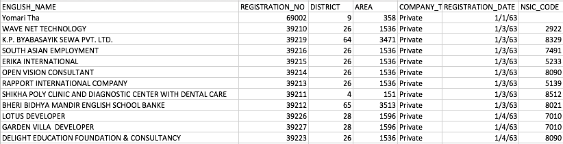

## Analyze Companies

### What you need to do

* If you haven’t used git before, take a [git class in codeschool](https://www.codeschool.com/courses/try-git).
* Once complete, create a private repo called “yipl-analyse-companies” in [bitbucket](https://bitbucket.org)
* Solve the problem detailed below
* Push your code to the repo (make sure that you have multiple commits with proper messages) 
* Invite bitbucket@yipl.com.np to that particular private repo

#### Problem

You need to write a script (in python or R) that reads all the CSV data from [Office of the Company Registar](http://www.ocr.gov.np/index.php/np/2016-06-16-05-09-06). The data is also available in this repo in the [data folder](data). The CSV data sample is shown below. 

You need to come up with the following outputs from the data.

* Number of companies in each district
* Top 10 NSIC sector codes interms of number of districts
* Trend of companies registration over the years

Then you need to generate appropriate plots for the above analysis. 

### Further instruction

* Write readme file with the instructions necessary to run the code.

### Bonus points

* Come up with as many interesting analysis from the data.
