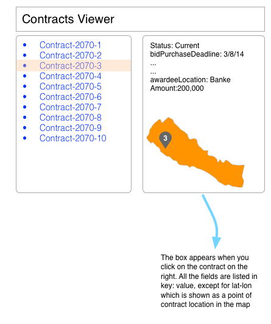

# Problem 

You have cleaned-up [contracts data](contracts.csv) in csv format. Your task is to create a viewer in html/javascript only to read the csv contracts file and allow the users to browse the contracts as per attached file. You may have the first listed contract auto-selected by default so that the right box displays the details of first contract. If the contract has lat-lon defined, you should show a point of that contract location in the Nepal map as shown below.

You may use any framework of your choice. 